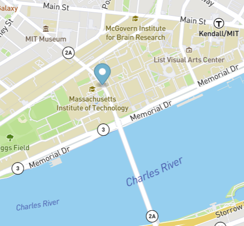

# Bus Stop
 Real time bus information for Boston MBTA

Static web pages can be boring, they are informative but struggle at times to keep relevant. Using async functions and JSON, this software provides a continuing update of one of the local MBTA busses near the MIT campus. The code fetches the data, parses it and then updates a marker on the map every second. 

 Future improvements could include tracking multiple busses, calculating the average speed, logging the data determining average arrival and departure times.

To run this software - download the files and save them into a folder. Using Visual Studio Code, or your preferred local web server, run index.html to see the program in action. 

MIT License

Copyright (c) 2022 matthewbrach

Permission is hereby granted, free of charge, to any person obtaining a copy of this software and associated documentation files (the "Software"), to deal in the Software without restriction, including without limitation the rights to use, copy, modify, merge, publish, distribute, sublicense, and/or sell copies of the Software, and to permit persons to whom the Software is furnished to do so, subject to the following conditions:

The above copyright notice and this permission notice shall be included in all copies or substantial portions of the Software.

THE SOFTWARE IS PROVIDED "AS IS", WITHOUT WARRANTY OF ANY KIND, EXPRESS OR IMPLIED, INCLUDING BUT NOT LIMITED TO THE WARRANTIES OF MERCHANTABILITY, FITNESS FOR A PARTICULAR PURPOSE AND NONINFRINGEMENT. IN NO EVENT SHALL THE AUTHORS OR COPYRIGHT HOLDERS BE LIABLE FOR ANY CLAIM, DAMAGES OR OTHER LIABILITY, WHETHER IN AN ACTION OF CONTRACT, TORT OR OTHERWISE, ARISING FROM, OUT OF OR IN CONNECTION WITH THE SOFTWARE OR THE USE OR OTHER DEALINGS IN THE SOFTWARE.
